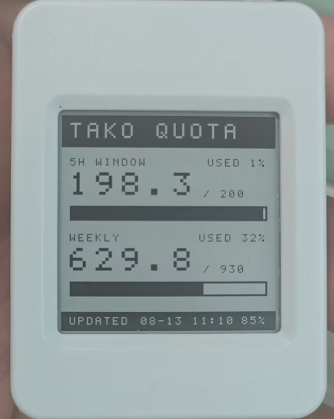

# epaper-154

Lights up the 1.54" 200x200 e-paper display on a **Waveshare ESP32-S3-Touch-ePaper-1.54 (V2)**.
Fetches live Tako quota data over Wi-Fi, updates the display, then enters deep
sleep until the configured refresh interval. The image stays visible while the
ESP32 and panel power rail are off.

Built and verified against ESP-IDF **v5.2.3** on real hardware.



购买地址：<https://detail.tmall.com/item.htm?id=973812969745>

## Pin map

From the [official schematic](https://files.waveshare.com/wiki/ESP32-S3-ePaper-1.54/ESP32-S3-Touch-ePaper-1.54-Schematic.pdf),
which lists these twice (module IO table + J10 connector); both copies agree.

| Signal | GPIO |
|---|---|
| EPD_BUSY | 8 |
| EPD_RST | 9 |
| EPD_D/C | 10 |
| EPD_CS | 11 |
| EPD_SCLK | 12 |
| EPD_SDI (MOSI) | 13 |
| EPD3V3_EN | 6 (active low) |
| EPD_TP_RST / EPD_TP_INT | 7 / 21 |
| Board I2C SDA / SCL | 47 / 48 |
| Battery ADC | 4 (ADC1 CH3, 1/2 divider) |
| Battery power latch | 17 (active high) |
| PWR button | 18 (active low) |

Two things worth knowing:

- **GPIO6 (`EPD3V3_EN`) is active low.** The driver configures it as an output
  and drives it low before resetting the panel, matching Waveshare's V2 BSP.
- **V1 boards (ESP32-S3FH4R2) use a different pin map.** Waveshare states their
  examples are not interchangeable between versions. This project targets V2
  (ESP32-S3-PICO-1-N8R8, 8MB flash / 8MB PSRAM).

## Build and flash

```bash
# activate ESP-IDF first: C:\Users\46907\esp\v5.2.3\esp-idf\export.ps1
idf.py set-target esp32s3
idf.py -p COM19 flash monitor
```

Note the export script rejects MSys/MinGW shells, so run it from PowerShell.

## Bluetooth setup

On first boot, the display shows `BLE SETUP` and the device advertises as
`TAKO-EPAPER`. Configuration is stored in NVS and contains:

- Wi-Fi SSID and password
- Tako API key
- refresh interval in minutes (`1` to `10080`, default `60`)

The password and API key characteristics require an encrypted BLE connection
and cannot be read back. They are never printed to the serial log.

The included Windows/Linux/macOS helper needs Python 3 and Bleak:

```powershell
python -m pip install -r tools/requirements.txt
python tools/configure_ble.py --ssid "My WiFi" --interval 60
```

It securely prompts for the Wi-Fi password and Tako API key. Windows or the
phone may show a BLE pairing confirmation the first time.

For a phone, a generic GATT client such as nRF Connect can also be used. Connect
and pair with `TAKO-EPAPER`, then write UTF-8 text to these characteristics:

| Value | UUID |
|---|---|
| SSID | `7b1e0001-b5a3-f393-e0a9-e50e24dcca9e` |
| Wi-Fi password | `7b1e0002-b5a3-f393-e0a9-e50e24dcca9e` |
| Tako API key | `7b1e0003-b5a3-f393-e0a9-e50e24dcca9e` |
| Refresh minutes | `7b1e0004-b5a3-f393-e0a9-e50e24dcca9e` |
| Command (`save`) | `7b1e0005-b5a3-f393-e0a9-e50e24dcca9e` |
| Status (read/notify) | `7b1e0006-b5a3-f393-e0a9-e50e24dcca9e` |

To change settings later, press the on-board **BOOT** button while the device is
sleeping. This wakes it directly into BLE setup. Do not hold BOOT while pressing
reset because GPIO0 is also the ESP32-S3 download-mode strap. A timer wake skips
Bluetooth, connects to Wi-Fi, refreshes Tako quota, and immediately returns to
deep sleep.

When setup was opened on a device that already has valid settings, the screen
shows `HOLD BOOT: EXIT`. Release the BOOT press that opened setup, then hold
BOOT for two seconds to discard any unsaved setup edits, reload the saved
configuration, and continue with a normal refresh. BOOT cannot bypass setup on
first boot when required settings are still missing.

If a scheduled refresh cannot connect or fetch data, the previous successful
e-paper image is preserved and the device retries at the next interval.

## Display refresh strategy

Scheduled updates use Waveshare's V2 partial-refresh waveform to avoid the
several black/white flashes of a full refresh. The previous 5000-byte frame and
refresh counter are retained in RTC memory across deep sleep and protected by
a checksum.

After 20 successful fast refreshes, the next display update uses a full refresh
to clear accumulated ghosting, then starts a new cycle. A cold boot, invalid
retained state, interrupted display update, or the setup screen also forces a
full refresh. Serial logs show `fast display refresh (n/20)` or
`full display refresh` for each update.

## Serial (USB) setup

Instead of Bluetooth you can configure the device over the native USB port.
Open the USB serial console (the same port as the log output, e.g. COM19) and
type these commands while the device shows `SETUP`:

| Command | Effect |
|---|---|
| `help` | list commands |
| `show` | print pending config (password and API key masked) |
| `ssid <text>` | set Wi-Fi SSID |
| `pass <text>` | set Wi-Fi password |
| `apikey <text>` | set Tako API key |
| `interval <min>` | set refresh minutes (1..10080) |
| `save` | validate and save |

Serial and BLE are both active during setup; the first channel to save wins.

## Battery

The battery level is read on ADC1 channel 3 (GPIO4, 1/2 divider) and shown as a
percentage at the right end of the footer. The mapping follows a rough LiPo
discharge curve, so treat it as an estimate. When no battery is fitted (USB
powered) the percentage is omitted.

On the V2 board, the PWR button only connects the battery to `VSYS`
momentarily. Firmware drives GPIO17 high at the start of `app_main()` and holds
it through deep sleep so battery power remains available after PWR is released.
When starting with only a battery connected, press PWR once to boot and latch
the supply. While the device is sleeping, PWR wakes it for an immediate refresh;
BOOT continues to wake directly into configuration mode.

## Tako API

The firmware follows Tako CLI's quota flow against `https://tako.shiroha.tech`:

1. The configured key is validated once with
   `POST /apiStats/api/get-key-id`; the returned numeric user ID is cached.
2. Each refresh calls `POST /apiStats/api/user-quota` and renders the rolling
   window and weekly `usage` / `plan` values.

HTTPS certificates are validated with ESP-IDF's built-in CA bundle. Device time
is synchronized over SNTP before the request and the footer uses China Standard
Time (`UTC+8`).

## Layout

| File | Purpose |
|---|---|
| `main/board.h` | pin assignments and SPI config |
| `main/battery.c` | battery ADC read and percentage mapping |
| `main/ble_config.c` | encrypted BLE GATT setup service |
| `main/device_config.c` | NVS-backed Wi-Fi, key, and interval settings |
| `main/epd_1in54.c` | SSD1681 init / refresh / sleep over SPI |
| `main/epd_paint.c` | 1bpp framebuffer: pixels, rects, lines, text |
| `main/font8x8.c` | 5x7 ASCII glyphs in 8x8 cells |
| `main/network.c` | Wi-Fi station and SNTP lifecycle |
| `main/serial_config.c` | USB serial command-line configuration |
| `main/tako_client.c` | HTTPS API requests and quota parsing |
| `main/main.c` | configuration, refresh, display, and deep-sleep flow |
| `tools/configure_ble.py` | desktop BLE provisioning helper |

## PSRAM

Disabled in `sdkconfig.defaults`. The module reports 8MB, but enabling quad
PSRAM fails ID detection (`PSRAM ID read error: 0x00ffffff`) and reboot-loops.
The framebuffer only needs 5KB of internal RAM, so this is left alone rather
than chased down. If a later feature needs PSRAM, the octal/quad line mode and
speed settings are the place to start.
